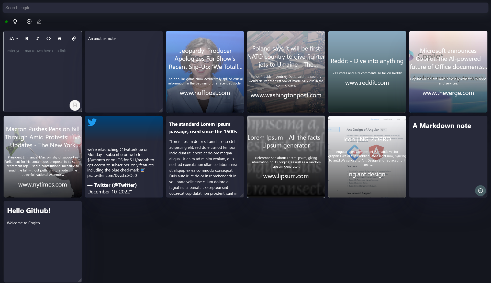
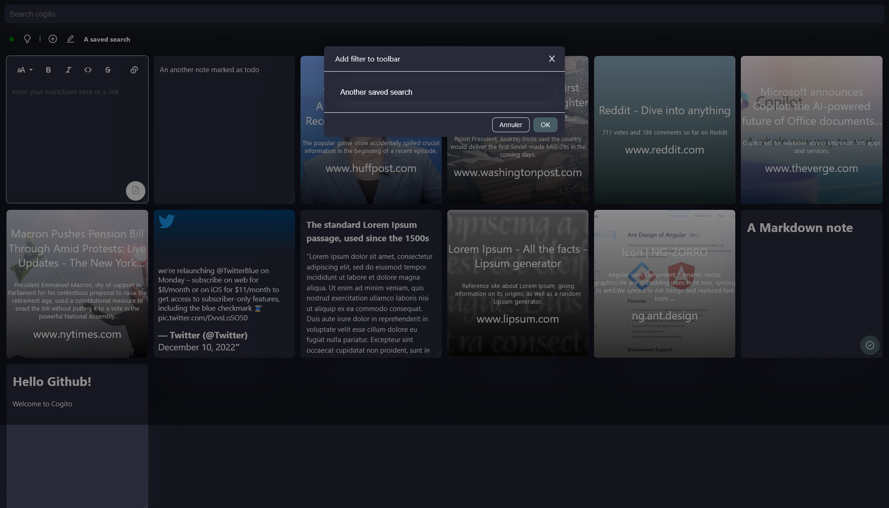
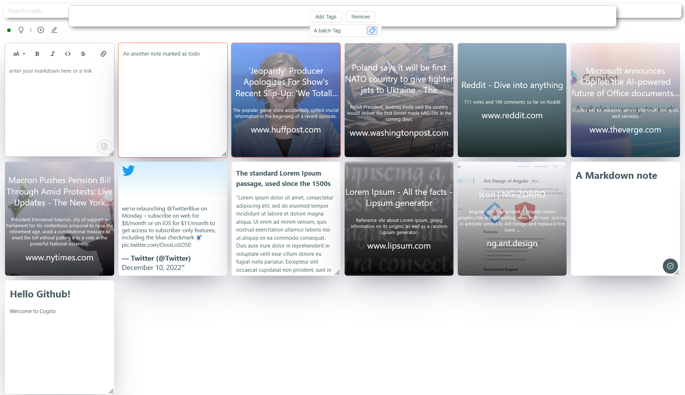
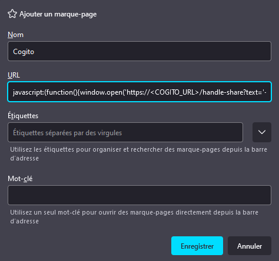

# Cogito


## TODO :
 - add notification support for forgotten todo card ?
 - take a screenshot of webpage saved
 - disable new account creation if needed

## Screenshot 






## Features

All you notes in one places

- add Link
- add Tweet
- add Note
- add Tag, Title, Comment
- Search in Article, Tweet and Note
- Automatic Tag with Natural langage processing
- Save search
- Dark theme
- Mark card as Todo
- Bulk remove or add tag (hold shift and select)
- PWA app (with share to cogito option on Android)
- Open to feature request

## Installation via docker-compose

- Create a folder named cogito
- add docker-compose.yml
- copy docker-compose.yml from project in the docker-compose.yml created (if raspberry use tukks/cogito-armv7:latest image instead of tukks/cogito:latest)
- modify APP_JWT_SECRET with a string (with bitwarden for example) of almost 256bit (128 char long)
- (optional) put your private and public key from twitter developer account
- modify HTTPS_ONLY with true or false (false for test only environnement)
- type in your shell `docker-compose up -d`
- go to SERVER-IP:8585
- click on new account, put an email and a password
- put your email and password on the login page
- profit
- feel free to open an issue

## Bookmarklet 

To save easily link on desktop, add this javascript line to a bookmark.
replace Cogito_URL by your url of cogito.

```javascript
javascript:(function(){window.open('https://<COGITO_URL>/handle-share?text='+encodeURIComponent(window.location.href));})()

```

Example in firefox :


## Launch dev

### Back

- add application-secret.properties with : 

```
api.twitter.key=
api.twitter.key.secret=
```

- Launch CogitoBackApplication.java

### Front

- npm i
- npm start

Go to localhost:4200
